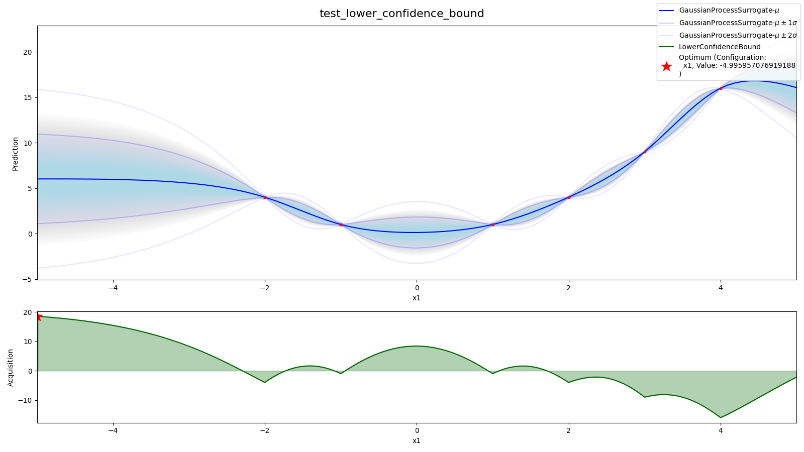
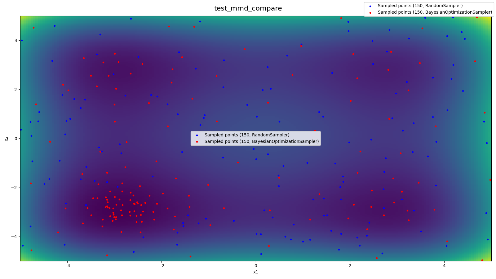
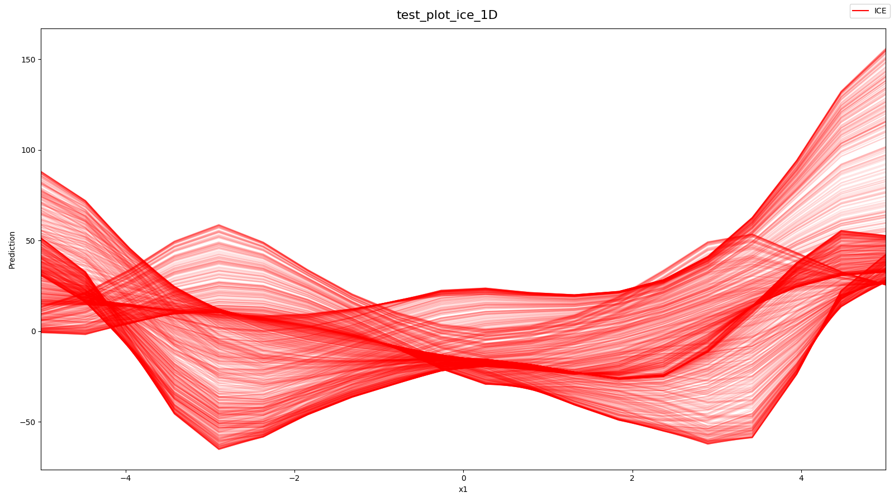
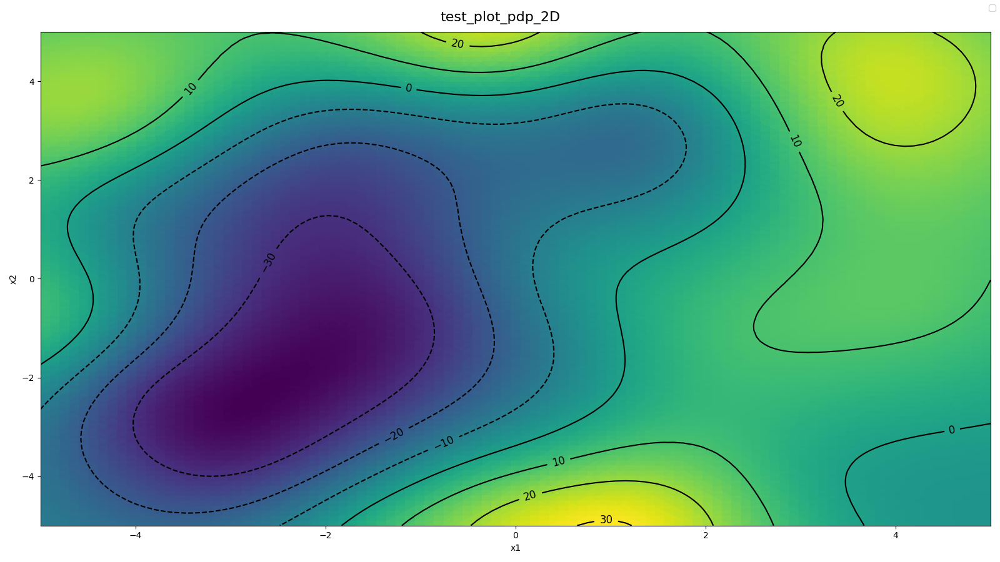
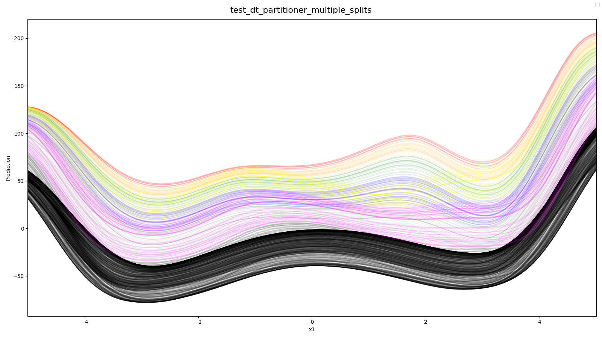
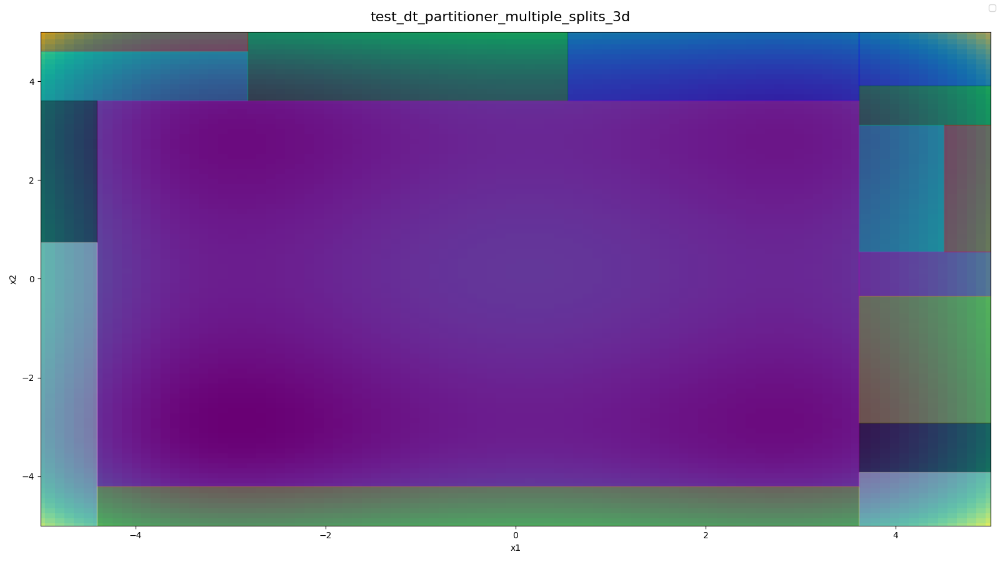

# Python PDP with Partitioner
[GitHub](https://github.com/dwoiwode/py-pdp-partitioner)

* Original Paper
  * [arXiv](https://arxiv.org/abs/2111.04820)
  * [GitHub](https://github.com/slds-lmu/paper_2021_xautoml)
  * [PDF](documentation/Explaining%20Hyperparameter%20Optimization%20via%20Partial%20Dependence%20Plots.pdf)

## Installation
You need to either create an environment or update an existing environment.
**After** creating an environment you have to activate it:
```
conda activate pyPDPPartitioner
```

### Create environment
```
conda env create -f environment.yml
```

### Update environment (if env exists)
```
conda env update -f environment.yml --prune
```

### Installation via pip
```
pip install pyPDPPartitioner
```

For [HPO-Bench](https://github.com/automl/HPOBench) examples, you further need to install HPOBench from git (e.g. `pip install git+https://github.com/automl/HPOBench.git@master`).
## Usage
### Blackbox functions
To use this package you need
* A Blackbox function (a function that gets any input and outputs a score)
* A Configuration Space that matches the required input of the blackbox function

There are some synthetic Blackbox-functions implemented that are ready to use:
```python
f = StyblinskiTang.for_n_dimensions(3)  # Create 3D-StyblinskiTang function
cs = f.config_space  # A config space that is suitable for this function
```

### Samplers
To sample points for fitting a surrogate, there are multiple samplers available:
- RandomSampler
- GridSampler
- BayesianOptimizationSampler with Acquisition-Functions:
  - LowerConfidenceBound
  - (ExpectedImprovement)
  - (ProbabilityOfImprovement)

````python
sampler = BayesianOptimizationSampler(f, cs)
sampler.sample(80)
````

### Surrogate Models
All algorithms require a `SurrogateModel`, which can be fitted with `SurrogateModel.fit(X, y)` and yields means and variances with `SurrogateModel.predict(X)`.

Currently, there is only a `GaussianProcessSurrogate` available.

````python
surrogate = GaussianProcessSurrogate()
surrogate.fit(sampler.X, sampler.y)
````
### Algorithms
There are some available algorithms:
- ICE
- PDP
- DecisionTreePartitioner
- RandomForestPartitioner

Each algorithm needs:
- A `SurrogateModel`
- One or many selected hyperparameter
- samples
- ``num_grid_points_per_axis``

Samples can be randomly generated via

```python
# Algorithm.from_random_points(...)
ice = ICE.from_random_points(surrogate, selected_hyperparameter="x1")
```

Also, all other algorithms can be built from an ICE-Instance.
````python
pdp = PDP.from_ICE(ice)
dt_partitioner = DecisionTreePartitioner.from_ICE(ice)
rf_partitioner = RandomForestPartitioner.from_ICE(ice)
````

The Partitioners can split the Hyperparameterspace of not selected Hyperparameters into multiple regions. 
The best region can be obtained using the incumbent of the sampler.
````python
incumbent_config = sampler.incumbent_config
dt_partitioner.partition(max_depth=3)
dt_region = dt_partitioner.get_incumbent_region(incumbent_config)

rf_partitioner.partition(max_depth=1, num_trees=10)
rf_region = rf_partitioner.get_incumbent_region(incumbent_config)
````

Finally, a new PDP can be obtained from the region. This PDP has the properties of a single ICE-Curve since the mean 
of the ICE-Curve results in a new ICE-Curve.
````python
pdp_region = region.pdp_as_ice_curve
````


## Plotting
Most components can create plots. These plots can be drawn on a given axis or are drawn on ``plt.gca()`` by default.

### Samplers
````python
sampler.plot()  # Plots all samples
````

### Surrogate
````python
surrogate.plot_means()  # Plots mean predictions of surrogate
surrogate.plot_confidences()  # Plots confidences
````
#### Acquisition Function
````python
surrogate.acq_func.plot()  # Plot acquisition function of surrogate model
````

### ICE
````python
ice.plot()  # Plots all ice curves. Only possible for 1 selected hyperparameter
````

### ICE Curve
````python
ice_curve = ice[0]  # Get first ice curve
ice_curve.plot_values()  # Plot values of ice curve 
ice_curve.plot_confidences()  # Plot confidences of ice curve 
ice_curve.plot_incumbent()  # Plot position of smallest value 
````

### PDP
````python
pdp.plot_values()  # Plot values of pdp
pdp.plot_confidences()  # Plot confidences of pdp 
pdp.plot_incumbent()  # Plot position of smallest value 
````

### Partitioner
````python
dt_partitioner.plot()  # only 1 selected hp, plots all ice curves in different color per region
dt_partitioner.plot_incumbent_cs(incumbent_config)  # plot config space of best region

rf_partitioner.plot_incumbent_cs(incumbent_config)  # plot incumbent config of all trees
````

### Regions
````python
region.plot_values()  # plot pdp of region
region.plot_confidences()  # plot confidence of pdp in region
````
## Plotting examples
### Surrogate
Source: [test/sampler/test_acquisition_function.py](test/sampler/test_acquisition_function.py)

* 1D-Surrogate model with mean + confidence
* acquisition function



### Sampler
Source: [test/sampler/test_mmd.py](test/sampler/test_mmd.py)

* Underlying blackbox function (2D-Styblinski-Tang)
* Samples from RandomSampler
* Samples from BayesianOptimizationSampler



### ICE
Source: [test/algorithms/test_ice.py](test/algorithms/test_ice.py)

* All ICE-Curves from 2D-Styblinski-Tang with 1 selected Hyperparameter




### PDP
Source: [test/algorithms/test_pdp.py](test/algorithms/test_pdp.py)

* 2D PDP (means)
* 2D PDP (confidences)
* All Samples for surrogate model


### PDP
Source: [src/main_2d_pdp.py](src/main_2d_pdp.py) (`num_grid_points_per_axis=100`)

* 2D PDP (means)




### Decision Tree Partitioner

Source: [test/algorithms/partitioner/test_partitioner.py](test/algorithms/partitioner/test_partitioner.py)

* All ICE-Curves splitt into 8 different regions (3 splits) (used 2D-Styblinski-Tang with 1 selected hyperparameter)



### Decision Tree Config Spaces
Source: [test/algorithms/partitioner/test_partitioner.py](test/algorithms/partitioner/test_partitioner.py)

* All Leaf-Config spaces from Decision Tree Partitioner with 3D-Styblinski-Tang Function and 1 Selected Hyperparameter (`x3`)
* 2D-Styblinkski-Tang in background


